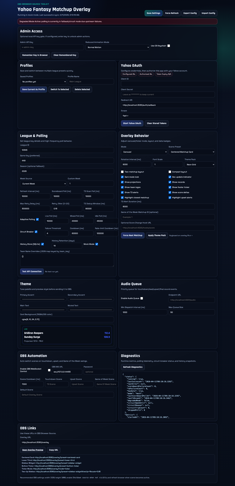
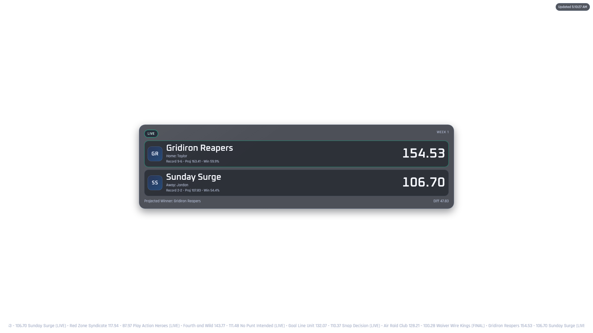
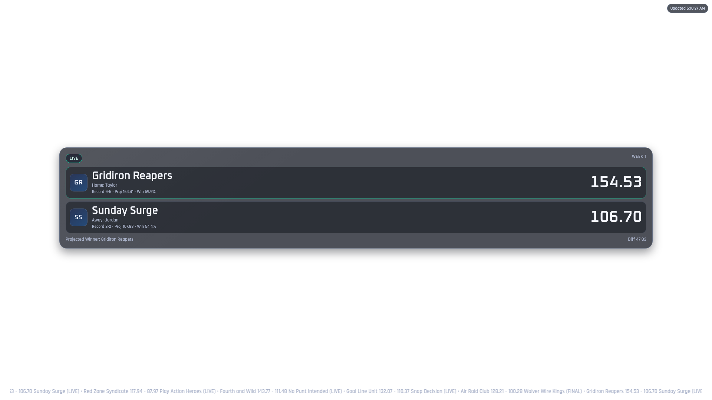
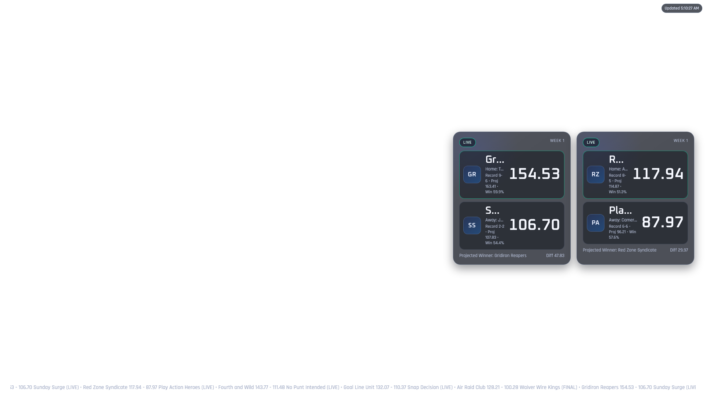
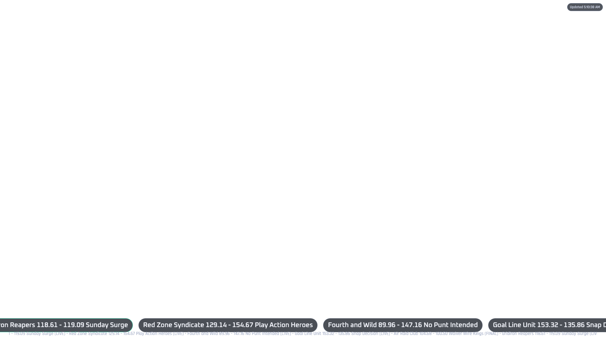

# Yahoo Fantasy Football OBS Overlay (Local)

A local Node.js + Express app that builds a real-time Yahoo Fantasy Football overlay for OBS Browser Source.

It supports:
- live matchup scoreboard polling
- touchdown player scan + alerts
- player-level scoring deltas for richer TD context
- rotating matchup carousel/ticker layouts
- no-refresh overlay updates via SSE with fallback polling + auto-reconnect
- admin/config UI with profile switching
- provider abstraction with live support for `yahoo`, `espn`, `sleeper`, and `mock`
- branding pack controls (title, watermark, font family presets)
- Discord/Slack webhook integrations for big events
- reliability features (cache fallback, safe-startup fallback, retries, circuit breaker, diagnostics)

## Architecture

### Backend (`/server`)
- `index.js`: Express app, routes, SSE bootstrap.
- `dataService.js`: polling engine, change detection, TD scan, event pipeline.
- `yahooAuth.js`: Yahoo OAuth flow and token refresh.
- `yahooApi.js`: Yahoo REST calls.
- `espnApi.js`: ESPN league fetch client (supports private leagues via SWID/S2 cookies).
- `sleeperApi.js`: Sleeper league/state/roster/matchup fetch client.
- `providerRegistry.js`: data-provider abstraction and routing.
- `integrations.js`: Discord/Slack webhook dispatch pipeline.
- `normalizer.js`: converts Yahoo payloads to a stable internal overlay model.
- `configStore.js`: settings load/validate/save.
- `tokenStore.js`, `secretStore.js`, `keychainStore.js`: local secret/token persistence.
- `historyStore.js`: optional snapshot/event history (SQLite when available).
- `profileStore.js`: multi-league profile save/switch.
- `audioQueue.js`: throttled event hook dispatch.
- `obsController.js`: optional OBS WebSocket scene triggers.
- `metrics.js`: lightweight counters/gauges + Prometheus text endpoint.

### Frontend (`/client`)
- `overlay.html/css/js`: broadcast overlay rendering for `/overlay`.
- `overlayTemplates.js`: reusable card markup templates with snapshot tests.
- `admin.html/css/js`: local control panel at `/admin`.

### Data Flow
1. Poll scoreboard at high frequency.
2. Normalize matchup payload.
3. Detect score/lead/upset/final changes.
4. Broadcast `update`/`status` events over SSE.
5. Overlay applies updates without full rerender.
6. Separate TD scanner runs on its own interval and emits TD events.

## Project Structure

```txt
FantasyFootball-Yahoo/
├─ client/
│  ├─ admin.html
│  ├─ admin.css
│  ├─ admin.js
│  ├─ overlay.html
│  ├─ overlay.css
│  ├─ overlay.js
│  └─ overlayTemplates.js
├─ server/
│  ├─ index.js
│  ├─ dataService.js
│  ├─ yahooAuth.js
│  ├─ yahooApi.js
│  ├─ espnApi.js
│  ├─ sleeperApi.js
│  ├─ providerRegistry.js
│  ├─ integrations.js
│  ├─ normalizer.js
│  ├─ configStore.js
│  ├─ defaultSettings.js
│  ├─ tokenStore.js
│  ├─ secretStore.js
│  ├─ keychainStore.js
│  ├─ profileStore.js
│  ├─ historyStore.js
│  ├─ audioQueue.js
│  ├─ obsController.js
│  ├─ tdStateStore.js
│  ├─ cacheStore.js
│  ├─ sseHub.js
│  ├─ metrics.js
│  ├─ logger.js
│  └─ utils.js
├─ public/
│  ├─ assets/
│  │  └─ logo-fallback.svg
│  └─ themes/
│     ├─ neon-grid.css
│     ├─ classic-gold.css
│     └─ ice-night.css
├─ config/
│  ├─ settings.json
│  └─ settings.example.json
├─ cache/
│  └─ .gitkeep
├─ docs/
│  └─ screenshots/
│     ├─ admin-config.png
│     ├─ overlay-demo.gif
│     ├─ overlay-centered-card.png
│     ├─ overlay-lower-third.png
│     ├─ overlay-sidebar-two-up.png
│     ├─ overlay-bottom-ticker.png
│     └─ manifest.json
├─ scripts/
│  ├─ generate-demo-gif.js
│  ├─ refresh-screenshots.js
│  ├─ check-screenshot-manifest.js
│  └─ generate-changelog.js
├─ test/
│  ├─ normalizer.test.js
│  ├─ dataService.test.js
│  ├─ providerNormalizers.test.js
│  └─ overlayTemplates.snapshot.test.js
├─ .env.example
├─ .gitignore
├─ package.json
├─ Dockerfile
├─ docker-compose.yml
└─ README.md
```

## Quick Start

1. Install dependencies:
```bash
npm install
```

2. Create env file:
```bash
cp .env.example .env
```

3. Start local server:
```bash
npm run dev
```

4. Open:
- Admin: [http://localhost:3030/admin](http://localhost:3030/admin)
- Overlay: [http://localhost:3030/overlay](http://localhost:3030/overlay)

## Screenshots

### Animated Demo


### Admin / Config



### Overlay - Centered Card



### Overlay - Lower Third



### Overlay - Sidebar Two-Up



### Overlay - Bottom Ticker



To regenerate the GIF after UI updates:
```bash
node scripts/generate-demo-gif.js
```

To refresh GIF + visual manifest together:
```bash
npm run screenshots:refresh
```

## `.env.example`

```bash
PORT=3030
APP_BASE_URL=http://localhost:3030
YAHOO_CLIENT_ID=
YAHOO_CLIENT_SECRET=
YAHOO_REDIRECT_URI=http://localhost:3030/auth/callback
ESPN_LEAGUE_ID=
ESPN_SEASON=
ESPN_WEEK=current
ESPN_SWID=
ESPN_S2=
SLEEPER_LEAGUE_ID=
SLEEPER_SEASON=
SLEEPER_WEEK=current
MOCK_MODE=true
ADMIN_API_KEY=
OVERLAY_API_KEY=
USE_OS_KEYCHAIN=false
```

## Yahoo OAuth Setup

1. Create Yahoo Developer app.
2. Set callback URI to `http://localhost:3030/auth/callback`.
3. In `/admin`, set `clientId`, `clientSecret`, redirect URI, and scope.
4. Save settings.
5. Click **Start Yahoo OAuth** and complete auth.

Storage behavior:
- Tokens: `config/tokens.json` (or macOS Keychain when enabled).
- Client secret/admin key: `config/secrets.json` (or macOS Keychain when enabled).
- Use `USE_OS_KEYCHAIN=true` or Admin setting `security.useOsKeychain=true` on macOS.

## ESPN Provider Setup

1. Set provider to `espn` in Admin.
2. Enter `espn.leagueId` and `espn.season` (week can be `current` or a custom week).
3. For public leagues, no auth cookies are required.
4. For private ESPN leagues, set both:
   - `espn.swid`
   - `espn.espnS2`
5. Run **Test API Connection**.

Notes:
- ESPN API access is unofficial and can change.
- SWID/S2 values are treated as secrets and redacted in admin responses.

## Sleeper Provider Setup

1. Set provider to `sleeper` in Admin.
2. Enter `sleeper.leagueId` and `sleeper.season`.
3. Set week to `current` or a custom week.
4. Run **Test API Connection**.

Notes:
- Sleeper endpoints are public; no OAuth/cookies required.

## High-Frequency Polling + TD Scan

Default frequency:
- scoreboard: every `10s` (`data.scoreboardPollMs`)
- TD scan: every `10s` (`data.tdScanIntervalMs`)

Adaptive polling:
- live slate: `adaptivePolling.liveMs`
- mixed slate: `adaptivePolling.mixedMs`
- idle slate: `adaptivePolling.idleMs`

Reliability controls:
- retry backoff + jitter
- circuit breaker with cooldown
- rate budget telemetry/alerts
- cached payload fallback
- preserved overlay rendering in degraded mode
- schedule-aware overnight throttling (NFL window aware)
- safe-mode startup fallback to cached/mock payload when Yahoo auth is unavailable

## Overlay Features

- carousel or ticker mode
- one-matchup or two-matchup layout
- score/projection/record/logo toggles
- smooth transitions for matchup rotation
- score delta indicators on changed scores
- closest matchup and upset highlight
- auto-redzone focus lock with urgency scoring (close games/upsets/recent swings)
- matchup story cards between rotations (top score, closest game, momentum/player surge)
- final-score styling
- optional pinned Game of the Week
- branding pack controls (league title, watermark, display/body fonts)
- protected overlay routes with optional `overlayKey`
- dev-only updated indicator
- transparent background for OBS

## Admin Features

From `/admin` you can:
- manage Yahoo credentials + OAuth
- choose provider (`yahoo`, `espn`, `sleeper`, `mock`)
- configure league id/game key/season/week
- set scoreboard and TD polling intervals
- configure schedule-aware polling window and off-hours poll rates
- tune adaptive polling + circuit breaker
- enable safe mode startup fallback behavior
- enable/disable projections/records/logos/ticker
- set theme colors/font scale/layout mode
- switch theme packs with one click
- configure branding (title/watermark/fonts)
- configure Discord/Slack webhooks + audio templates
- save/switch/delete profiles (multi-league)
- force refresh, force next matchup, pause/resume rotation, pin matchup, and force story card
- export/import config JSON
- view diagnostics/events history
- export matchup timeline as JSON or CSV from history store and replay snapshots
- configure audio hook and OBS scene automation

## Scene Presets + Query Params

Overlay route is fixed at `/overlay`.

Useful params:
- `preset=centered-card`
- `preset=lower-third`
- `preset=sidebar-widget`
- `preset=bottom-ticker`
- `mode=ticker`
- `twoUp=1`
- `scale=0.90`
- `overlayKey=YOUR_READ_KEY` (when configured)

Direct scene routes (OBS-friendly):
- `/overlay/centered-card`
- `/overlay/lower-third`
- `/overlay/sidebar-widget`
- `/overlay/bottom-ticker`
- `/overlay/ticker`

Example:
- `http://localhost:3030/overlay?preset=lower-third&scale=0.95`

## OBS Browser Source Setup

1. In OBS, add **Browser Source**.
2. URL: `http://localhost:3030/overlay`.
   - If overlay read key is enabled, use `http://localhost:3030/overlay?overlayKey=YOUR_KEY`.
3. Recommended size: `1920 x 1080`.
4. Keep transparency enabled.
5. Optional: duplicate Browser Source with different query params per scene preset.

## Docker Profiles

- Local profile (port `3030`):  
  `docker compose --profile local up --build`
- Mock demo profile (port `3031`):  
  `docker compose --profile mock up --build`

Both services include container healthchecks against `/health`.

## API Endpoints

Public:
- `GET /health`
- `GET /metrics`
- `GET /events`
- `GET /api/public-config`
- `GET /api/public-snapshot`
- `GET /overlay`
- `GET /overlay/centered-card`
- `GET /overlay/lower-third`
- `GET /overlay/sidebar-widget`
- `GET /overlay/bottom-ticker`
- `GET /overlay/ticker`
- `GET /admin`

Admin-protected (when `ADMIN_API_KEY` configured):
- `GET /api/config`
- `PUT /api/config`
- `GET /api/config/export`
- `POST /api/config/import`
- `GET /api/status`
- `GET /api/diagnostics`
- `GET /api/history`
- `GET /api/history/export?format=json|csv&hours=168`
- `POST /api/history/replay`
- `GET /api/data`
- `POST /api/refresh`
- `POST /api/test-connection`
- `POST /api/control/next`
- `POST /api/control/pause`
- `POST /api/control/resume`
- `POST /api/control/pin`
- `POST /api/control/unpin`
- `POST /api/control/story`
- `POST /api/auth/logout`
- `GET /auth/start`
- `GET /api/profiles`
- `POST /api/profiles/save`
- `POST /api/profiles/switch`
- `DELETE /api/profiles/:profileId`

## Mock/Fallback Mode

Use mock mode when Yahoo auth is not ready:
- Set `MOCK_MODE=true` in `.env`, or
- Toggle in Admin Data settings.

Mock mode keeps overlay fully testable for OBS scene/layout work.

## Tests and CI

Run locally:
```bash
npm test
npm run visual:check
```

GitHub Actions CI (`.github/workflows/ci.yml`) runs on push/PR:
- dependency install
- syntax checks
- unit tests

Additional workflows:
- `visual-regression.yml`: verifies screenshot manifest hashes.
- `release.yml`: bumps version, refreshes screenshots, updates changelog, tags release, publishes GitHub release.

## Troubleshooting

### OAuth callback fails
- Verify redirect URI exactly matches Yahoo app config.
- Confirm client id/secret are valid.
- Use **Clear Stored Tokens** and retry.

### No live data
- Confirm league id and game key/season.
- Run **Test API Connection** in admin.
- Temporarily enable mock mode to verify overlay pipeline.

### Overlay not updating
- Check `/events` stream connectivity.
- Overlay auto-falls back to `/api/public-snapshot` polling if SSE drops (see fallback indicator).
- Check `/health` and `/metrics`.
- Watch `/api/diagnostics` for polling errors/circuit-open state.

### TD alerts missing
- Ensure TD alerts are enabled.
- TD scan only tracks active lineup slots (bench/IR excluded).
- Dedup cooldown may suppress repeat events for same player total.

### Admin routes return 401
- If `ADMIN_API_KEY` is set, pass `x-admin-key` with admin requests.

### Overlay routes return 401
- If `OVERLAY_API_KEY`/`security.overlayApiKey` is set, append `?overlayKey=...` to `/overlay` and `/events`.

### SQLite history unavailable
- `node:sqlite` may be unavailable on older Node versions.
- App will continue running; history snapshots are disabled gracefully.

## Customization Notes

Primary customization files:
- `config/settings.json` for persistent settings
- `client/overlay.css` for bespoke broadcast styling
- `public/themes/*.css` for reusable theme packs

For league-specific branding:
- use `league.teamNameOverrides`
- change `theme.primary`, `theme.secondary`, `theme.background`, `theme.text`
- set `overlay.scenePreset`, `overlay.layout`, `overlay.rotationIntervalMs`
